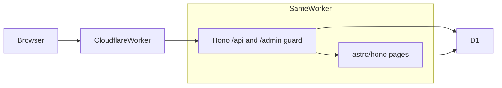

# Fuwari CMS

> **状态：一期功能可用 · 线上需自行部署**（阶段 0–4 完成；阶段 5 文档就绪，本仓库不代为执行远程命令）  
> Fuwari 风前台 + Cloudflare D1 正文库 + 同站 `/admin` 写稿。

看起来像 [Fuwari](https://github.com/saicaca/fuwari)，但文章存在 D1、可后台编辑——跑在 **一个 Cloudflare Worker** 上，发文后刷新公开站即可见，不必把 Markdown 推进 Git 再构建。

进度与每阶段验收见 [PLAN.md](./PLAN.md)；重大变更见 [MONUMENTS.md](./MONUMENTS.md)；更早的取舍长文见 [docs/初版开发思路.md](./docs/初版开发思路.md)。

## 一句话

**同一 Worker：公开站长得像 Fuwari；管理员登录 `/admin` 用 Markdown 写文章；正文进 D1；发布后 SSR 直接读库。**

---

## 设计思路

| 想要 | 常见缺口 |
|------|----------|
| 好看（偏 Fuwari） | 不少 Cloudflare CMS 功能强，默认观感不对味 |
| 后台 + 真数据库 | Fuwari 本身是纯静态 Markdown，无 D1、无管理端 |
| 托管在 Cloudflare | 需要 Workers + D1（二期再可选 R2 / Workers AI） |

不是给别的 CMS 换皮，也不是继续用 Git 当数据库。

**策略：拷贝主题壳，替换内容源。** 从 Fuwari 固定提交 `6d39b0d` 带走 Layout / Navbar / 卡片 / Markdown 样式；去掉 Content Collections 与 `getCollection`。文章 Markdown 存在 D1 的 `body_md`，**写入时**在 Worker 里渲染成 `body_html`，前台只读缓存 HTML。草稿永远不进公开查询。

一期边界：封面/头像/banner 用 URL 字符串（外链或站点内路径），不上 R2；无评论、无全文搜索、无真 AI（`/api/admin/ai/*` 返回 501）。`site_settings` 里空着的字段按字段 overlay [`src/config.ts`](./src/config.ts) 的当前前端默认值。

后台保持素：Markdown 文本框 + 预览弹窗。好看留给前台。

### 一期成功标准

对照 [docs/初版开发思路.md](./docs/初版开发思路.md) 第 12 节，**代码已满足**下列条目；线上是否通过取决于你是否按本文完成远端 D1、密钥与 `pnpm run deploy`。

- 管理员能登录后台，创建 / 编辑 / 发布 / 撤回草稿
- 公开站首页、文章页、标签 / 归档看起来就是 Fuwari 那路
- 刷新公开站能读到刚发布的 D1 内容，无需把文章文件 `git push`
- 草稿绝不会出现在公开列表
- 仓库有清晰归属：主题来自 Fuwari（MIT）

---

## 技术架构



| 层 | 选型 |
|----|------|
| 前台 | Astro 7 SSR + Tailwind 3（Fuwari `6d39b0d`，MIT） |
| 运行时 | Cloudflare Workers（`@astrojs/cloudflare` 14） |
| 入口 | [`src/fetch.ts`](./src/fetch.ts)：Hono `/api/*` → `/admin` session 守卫 → `astro/hono` 的 `actions()` / `middleware()` / `pages()` / `i18n()` |
| API | Hono（[`src/api/app.ts`](./src/api/app.ts)，可脱离 Astro 单测） |
| 数据库 | D1，binding 名 `DB`（不是环境变量） |
| 鉴权 | 单管理员；PBKDF2-SHA256；D1 `sessions` + HMAC 签名 Cookie `sid` |
| Markdown | [`src/lib/markdown.ts`](./src/lib/markdown.ts) 仅在写入时运行 |
| 公开读 | [`src/lib/posts.ts`](./src/lib/posts.ts)，永远 `status = 'published'` |
| 后台写 | [`src/lib/admin-posts.ts`](./src/lib/admin-posts.ts)（含草稿） |

**密钥：** 必配且仅此一项——`SESSION_SECRET`。本地放 [`.dev.vars`](./.dev.vars.example)；生产用 `wrangler secret put`。**永远不要**写进 [`wrangler.jsonc`](./wrangler.jsonc) 或 Git。

**语言：** 访客 `locale` cookie 优先；没有 cookie 时用 D1 `site_settings.lang`，再空则 `src/config.ts` 的 `siteConfig.lang`。

Swup 忽略 `/admin`，后台自己切 tab。

---

## 数据库设计

Schema 以 [`migrations/`](./migrations/) 为准。读路径上，空字符串 / NULL 按字段回退 `src/config.ts`。

### `users`

| 列 | 说明 |
|----|------|
| `id` | INTEGER PK |
| `username` | UNIQUE；一期固定 `admin` |
| `password_hash` | PBKDF2 串，首次访问 `/admin/login` 写入 |
| `created_at` | 默认 `datetime('now')` |

### `sessions`

| 列 | 说明 |
|----|------|
| `id` | TEXT PK（32 字节 hex） |
| `user_id` | FK → `users`，ON DELETE CASCADE |
| `expires_at` | 登录时 `datetime('now', '+7 days')` |
| `created_at` | |

索引：`idx_sessions_expires_at`。

### `posts`

| 列 | 说明 |
|----|------|
| `id` | INTEGER PK |
| `slug` | UNIQUE，kebab-case |
| `title` / `description` | |
| `body_md` / `body_html` | 原文与写入时渲染结果 |
| `excerpt` / `headings_json` | 列表摘要与目录 |
| `cover_url` | 外链或站点路径 |
| `status` | `draft` \| `published` |
| `category` | 可空 |
| `lang` | 文章内容语言，默认 `en` |
| `published_at` | published 时非空（表级 CHECK） |
| `created_at` / `updated_at` | |
| `word_count` / `reading_minutes` | 写入时计算 |

索引：`idx_posts_status_published_at`（`status, published_at DESC`）。slug 靠 UNIQUE。

### `tags` / `post_tags`

多对多；侧栏标签与 `/archive/?tag=` 用这两张表。`post_tags` 主键 `(post_id, tag_id)`，删除文章级联。

### `site_settings`

单行，`id` 必须为 `1`。

| 列 | 来源 | 用途 |
|----|------|------|
| `avatar` / `name` / `bio` / `links_json` | 0002 | 侧栏资料与三链 |
| `banner_json` | 0002 | 首页 banner |
| `title` / `subtitle` / `footer` | 0003 | 导航品牌、副标题、页脚第二行 |
| `about_md` / `about_html` | 0003 | About 页 |
| `lang` | 0004 | 无 cookie 时的默认 UI 语言 |
| `updated_at` | | |

**禁止**把 [`scripts/seed.sql`](./scripts/seed.sql) 用 `--remote` 打进生产库（本地演示稿而已）。

---

## 本地开发

需要 Node ≥ 22.12；pnpm 由 Corepack 按 `package.json` 的 `packageManager` 提供（`corepack enable --install-directory <用户目录>` 后加入 PATH）。

```sh
pnpm install
cp .dev.vars.example .dev.vars   # 改 SESSION_SECRET；勿提交
pnpm db:migrate:local            # migrations/ → 本地 D1
pnpm db:seed:local               # 演示文章；不要 --remote
pnpm dev                         # http://localhost:4321
pnpm build                       # astro check + build → dist/
pnpm preview                     # wrangler 跑生产包
pnpm lint / pnpm format          # Biome
pnpm test                        # Vitest，跑在 workerd
```

`.dev.vars` 里的 `SESSION_SECRET` 换成足够长的随机串。首次打开 http://localhost:4321/admin/login 为用户名 `admin` 设密码（≥ 8，`users` 为空时）。登录后：

- `/admin` 文章
- `/admin/profile` 头像、简介、三链、banner
- `/admin/site` 标题、页脚、默认语言
- `/admin/about` About Markdown

未写入 D1 的字段沿用 `src/config.ts`。若要重新设密：

```sh
pnpm exec wrangler d1 execute fuwari-cms --local --command "DELETE FROM sessions; DELETE FROM users;"
```

---

## 环境变量与绑定

一期 **只有一个密钥**，没有其它 `vars`。

| 名字 | 本地 | 生产 | 说明 |
|------|------|------|------|
| `SESSION_SECRET` | `.dev.vars` | `wrangler secret put SESSION_SECRET` | HMAC 签 `sid` Cookie；`wrangler.jsonc` 里 `secrets.required` 会在部署时校验它存在，但**不要把值写进 jsonc** |
| `DB` | wrangler 本地 SQLite | D1 绑定 | 在 [`wrangler.jsonc`](./wrangler.jsonc) 的 `d1_databases`，不是 env |

生成随机密钥示例：

```sh
# Unix
openssl rand -base64 32

# PowerShell
[Convert]::ToBase64String((1..32 | ForEach-Object { Get-Random -Maximum 256 }) -as [byte[]])
```

---

## 部署

本仓库**不代为执行**远端 `deploy` / `secret put` / `migrations apply --remote`。按下面做完，Worker 才会在 Cloudflare 上跑起来。

两种方法共用同一套前置。

### 前置

1. Cloudflare 账号；本机 Node ≥ 22.12 + Corepack pnpm 9。
2. `pnpm exec wrangler login`（方法 B 用 API Token，见下）。
3. 创建远端库并把 **真实 `database_id` 写进** [`wrangler.jsonc`](./wrangler.jsonc)，替换占位 `00000000-0000-0000-0000-000000000000`：

```sh
pnpm exec wrangler d1 create fuwari-cms
```

4. 配 `SESSION_SECRET`（见上一节）。本地 `.dev.vars` 与生产 secret **互不影响**。
5. 把 [`migrations/`](./migrations/) 打到**远端** D1（本地 `pnpm db:migrate:local` 不会同步上去）：

```sh
pnpm db:migrate:remote
```

6. 部署成功后打开 `https://<worker-name>.workers.dev/admin/login`，为 `admin` 设密码。可选：Dashboard → Workers → 自定义域。

不要对远端执行 `pnpm db:seed:local` / `scripts/seed.sql`。

### 方法 A — 本机 Wrangler（推荐）

```sh
pnpm install
# 已完成：wrangler.jsonc 里的 database_id、pnpm db:migrate:remote
pnpm exec wrangler secret put SESSION_SECRET
pnpm run deploy
```

必须写 `pnpm run deploy`：pnpm 9 把裸的 `pnpm deploy` 当成 workspace 拷包命令，会报 `ERR_PNPM_CANNOT_DEPLOY`。脚本内容是 `pnpm build` + `wrangler deploy`。之后改代码再执行一次 `pnpm run deploy` 即可；库结构变了再跑 `pnpm db:migrate:remote`。

### 方法 B — GitHub Actions

适合每次 push 自动发版。本仓库**不附带** workflow 文件（避免未配 Token 时 CI 变红）；在仓库里自行添加即可。

1. Cloudflare Dashboard → 创建 API Token，权限至少包含 **Workers Scripts 编辑** 与 **D1 编辑**。
2. GitHub 仓库 Secrets：
   - `CLOUDFLARE_API_TOKEN`
   - `CLOUDFLARE_ACCOUNT_ID`
3. **`SESSION_SECRET` 仍用方法 A 的 `wrangler secret put` 配在 Worker 上**，不要当作构建时环境变量写进 GitHub Secrets（以免进日志或被误当成 `vars`）。
4. 工作流建议：`pnpm install` → `pnpm build` → `pnpm db:migrate:remote` → `pnpm exec wrangler deploy`。首次建议 `workflow_dispatch` 手动点一次。

[`wrangler.jsonc`](./wrangler.jsonc) 的 `database_id` 必须已是真实 ID（可提交）；密钥不能提交。

---

## 仓库结构

```
.
├── src/
│   ├── fetch.ts              # Worker 入口：Hono(/api) → /admin 守卫 → astro/hono
│   ├── api/app.ts            # Hono 路由（可脱离 Astro 单测）
│   ├── lib/posts.ts          # 公开文章（仅 published）
│   ├── lib/admin-posts.ts    # 后台文章（含草稿）
│   ├── lib/site-settings.ts  # 资料 / banner / 站点身份 / about
│   ├── lib/markdown.ts       # 写入时 Markdown → body_html
│   ├── lib/auth/             # PBKDF2 + D1 session + 首次设密
│   ├── plugins/              # 改编自 Fuwari 的 remark 插件
│   ├── types/post.ts         # PostEntry：预渲染 bodyHtml + 摘要/字数/目录
│   ├── pages/ components/ layouts/ styles/ i18n/ utils/ constants/ assets/ config.ts
│   │                         # Fuwari 主题（见 third_party/fuwari/README.md）
├── tests/                    # Vitest（workerd）
├── migrations/               # D1 迁移 SQL
├── scripts/seed.sql          # 本地演示文章（不要 --remote）
├── astro.config.mjs  wrangler.jsonc  vitest.config.ts  biome.json  tsconfig.json
├── PLAN.md  MONUMENTS.md  AGENTS.md
├── docs/初版开发思路.md
├── LICENSE  NOTICE
└── third_party/fuwari/       # 上游 MIT 原文 + 拷贝清单
```

---

## 分期

**一期（MVP，已实现）**  
登录、文章 CRUD、资料/站点/About、中英 UI、公开列表/详情/标签/归档对齐 Fuwari、草稿不公开。

**二期**  
R2 上传、Workers AI（标题/摘要等）、搜索。

**三期**  
更舒服的编辑器、统计与其它扩展（按需）。

---

## 许可与归属

本项目自有内容采用 **[MIT License](./LICENSE)**  
Copyright (c) 2026 Angelen Atano

前台主题基于 **[Fuwari](https://github.com/saicaca/fuwari)**（MIT © 2024 saicaca）提交 `6d39b0d`。上游许可原文见 [`third_party/fuwari/LICENSE`](./third_party/fuwari/LICENSE)，拷贝与改编清单见 [`third_party/fuwari/README.md`](./third_party/fuwari/README.md)；完整第三方说明见 [`NOTICE`](./NOTICE)。

选用 MIT 的原因：与 Fuwari 及 Astro / Hono 等依赖许可兼容，便于复用主题并保持后续自有代码同样宽松可分发；本仓库**不**基于 GPL 等强 copyleft 成品派生。

---

## 欢迎

如果你也想要「好看的个人博客 + Cloudflare 真 CMS」，欢迎 Watch / Star，或开 Issue 聊需求与取舍。  
实现进度会直接推到本仓库。
