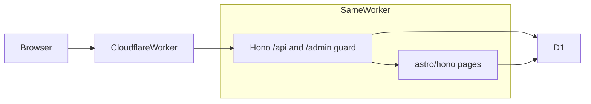

# Fuwari CMS

**English** | [简体中文](./README.zh-CN.md)

> **Status: phase-1 features are ready · you deploy remotely** (phases 0–4 done; phase 5 docs are ready; this repo does not run remote commands for you)
> Fuwari-style public site + Cloudflare D1 content + in-site `/admin` writing.

It looks like [Fuwari](https://github.com/saicaca/fuwari), but posts live in D1 and can be edited in the admin UI. Everything runs on **one Cloudflare Worker**. After you publish, a refresh of the public site is enough — you do not git-push Markdown and rebuild.

Phased plan and acceptance checks: [PLAN.md](./PLAN.md). Major changes: [MONUMENTS.md](./MONUMENTS.md). Longer design notes (Chinese): [docs/初版开发思路.md](./docs/初版开发思路.md).

## In one sentence

**Same Worker: the public site looks like Fuwari; the admin logs into `/admin` and writes Markdown; bodies go to D1; after publish, SSR reads the database.**

---

## Design

| Want | Usual gap |
|------|-----------|
| Looks like Fuwari | Many Cloudflare CMS tools are capable but do not look right |
| Admin + a real database | Fuwari itself is static Markdown — no D1, no admin |
| Hosted on Cloudflare | Needs Workers + D1 (R2 / Workers AI later) |

This is not a reskin of another CMS, and Git is not the database.

**Strategy: copy the theme shell, replace the content source.** Take Layout / Navbar / cards / Markdown styles from Fuwari commit `6d39b0d`; drop Content Collections and `getCollection`. Post Markdown is stored as D1 `body_md` and **rendered at write time** to `body_html` (Worker by default; `/admin/site` can switch to the browser). Public pages only read cached HTML. Drafts never enter public queries.

Phase-1 limits: cover / avatar / banner are URL strings (remote or in-site paths), no R2; no comments; no FTS full-text index; no real AI (`/api/admin/ai/*` returns 501). Navbar search is `GET /api/search` (`LIKE` on published posts only). Empty `site_settings` fields overlay the current frontend defaults in [`src/config.ts`](./src/config.ts).

Admin stays plain: a Markdown textarea plus a preview modal. Looks belong on the public site.

### Phase-1 success criteria

Against [docs/初版开发思路.md](./docs/初版开发思路.md) section 12, **the code already meets** the items below. Production still depends on you creating remote D1, putting the secret, and running `pnpm run deploy`.

- Admin can sign in, create / edit / publish / unpublish drafts
- Home, post pages, tags / archive look like Fuwari
- A refresh of the public site shows newly published D1 content; no `git push` of post files
- Drafts never appear in public lists
- Attribution is clear: the theme comes from Fuwari (MIT)

---

## Architecture



| Layer | Choice |
|-------|--------|
| Public UI | Astro 7 SSR + Tailwind 3 (Fuwari `6d39b0d`, MIT) |
| Runtime | Cloudflare Workers (`@astrojs/cloudflare` 14) |
| Entry | [`src/fetch.ts`](./src/fetch.ts): Hono `/api/*` → `/admin` session guard → `astro/hono` `actions()` / `middleware()` / `pages()` / `i18n()` |
| API | Hono ([`src/api/app.ts`](./src/api/app.ts), unit-testable without Astro) |
| Database | D1, binding name `DB` (not an env var) |
| Auth | Single admin; PBKDF2-SHA256; D1 `sessions` + HMAC-signed `sid` cookie |
| Markdown | [`src/lib/markdown.ts`](./src/lib/markdown.ts) at write time (Worker by default; `/admin/site` can use the browser); fences via `rehype-expressive-code` (Shiki JavaScript engine) |
| Public reads | [`src/lib/posts.ts`](./src/lib/posts.ts), always `status = 'published'` |
| Admin writes | [`src/lib/admin-posts.ts`](./src/lib/admin-posts.ts) (includes drafts) |

**Secret:** exactly one required value — `SESSION_SECRET`. Local: [`.dev.vars`](./.dev.vars.example). Production: `wrangler secret put`. **Never** put it in [`wrangler.jsonc`](./wrangler.jsonc) or Git.

**UI language:** visitor `locale` cookie first; else D1 `site_settings.lang`; else `siteConfig.lang` in `src/config.ts`.

Swup ignores `/admin`; the admin UI swaps tabs itself.

---

## Database

Schema is [`migrations/`](./migrations/). On read paths, empty string / NULL fields fall back to `src/config.ts`.

### `users`

| Column | Notes |
|--------|-------|
| `id` | INTEGER PK |
| `username` | UNIQUE; phase 1 is always `admin` |
| `password_hash` | PBKDF2 string, written on first visit to `/admin/login` |
| `created_at` | Default `datetime('now')` |

### `sessions`

| Column | Notes |
|--------|-------|
| `id` | TEXT PK (32-byte hex) |
| `user_id` | FK → `users`, ON DELETE CASCADE |
| `expires_at` | Set at login to `datetime('now', '+7 days')` |
| `created_at` | |

Index: `idx_sessions_expires_at`.

### `posts`

| Column | Notes |
|--------|-------|
| `id` | INTEGER PK |
| `slug` | UNIQUE, kebab-case |
| `title` / `description` | |
| `body_md` / `body_html` | Source Markdown and write-time HTML (Worker or browser) |
| `excerpt` / `headings_json` | List excerpt and TOC |
| `cover_url` | Remote URL or in-site path |
| `status` | `draft` \| `published` |
| `category` | Nullable |
| `lang` | Post content language, default `en` |
| `published_at` | Required when published (table CHECK) |
| `created_at` / `updated_at` | |
| `word_count` / `reading_minutes` | Computed at write time |

Index: `idx_posts_status_published_at` (`status, published_at DESC`). Slug uniqueness is the UNIQUE constraint.

### `tags` / `post_tags`

Many-to-many. Sidebar tags and `/archive/?tag=` use these tables. `post_tags` PK is `(post_id, tag_id)`; deleting a post cascades.

### `site_settings`

Single row; `id` must be `1`.

| Column | Migration | Use |
|--------|-----------|-----|
| `avatar` / `name` / `bio` / `links_json` | 0002 | Sidebar profile and three links |
| `banner_json` | 0002 | Home banner |
| `title` / `subtitle` / `footer` | 0003 | Nav brand, subtitle, footer second line |
| `about_md` / `about_html` | 0003 | About page |
| `lang` | 0004 | Default UI language when there is no cookie |
| `client_markdown` | 0005 | Admin: render Markdown in the browser (NULL = off) |
| `updated_at` | | |

**Do not** apply [`scripts/seed.sql`](./scripts/seed.sql) with `--remote` (local demo posts only).

---

## Local development

Node ≥ 22.12. pnpm comes from Corepack via `packageManager` in `package.json` (`corepack enable --install-directory <user dir>`, then PATH).

```sh
pnpm install
cp .dev.vars.example .dev.vars   # set SESSION_SECRET; do not commit
pnpm db:migrate:local            # migrations/ → local D1
pnpm db:seed:local               # demo posts; not --remote
pnpm dev                         # http://localhost:4321
pnpm build                       # astro check + build → dist/
pnpm preview                     # wrangler serves the production bundle
pnpm lint / pnpm format          # Biome
pnpm test                        # Vitest, inside workerd
```

Replace `SESSION_SECRET` in `.dev.vars` with a long random string. First visit to http://localhost:4321/admin/login sets the password for username `admin` (≥ 8, when `users` is empty). After login:

- `/admin` posts (timeline by publish date; search; filter by tag / status; **Re-render posts** refreshes stored HTML with the current renderer, without changing status or dates)
- `/admin/profile` avatar, bio, three links, banner
- `/admin/site` title, footer, default language, **Render Markdown in the browser**
- `/admin/about` About Markdown

Fields not stored in D1 keep `src/config.ts`. To redo local setup:

```sh
pnpm exec wrangler d1 execute fuwari-cms --local --command "DELETE FROM sessions; DELETE FROM users;"
```

---

## Env and bindings

Phase 1 has **one secret** and no other `vars`.

| Name | Local | Production | Notes |
|------|-------|------------|-------|
| `SESSION_SECRET` | `.dev.vars` | `wrangler secret put SESSION_SECRET` | HMAC for the `sid` cookie; `secrets.required` in `wrangler.jsonc` checks it exists on deploy — **do not put the value in jsonc** |
| `DB` | Wrangler local SQLite | D1 binding | [`wrangler.jsonc`](./wrangler.jsonc) `d1_databases`, not env |

Random secret examples:

```sh
# Unix
openssl rand -base64 32

# PowerShell
[Convert]::ToBase64String((1..32 | ForEach-Object { Get-Random -Maximum 256 }) -as [byte[]])
```

---

## Deploy

This repo **does not** run remote `deploy` / `secret put` / `migrations apply --remote` for you. After the steps below you get a `*.workers.dev` public site and `/admin`.

Local `pnpm dev` uses Wrangler’s **on-disk SQLite** under `.wrangler/`. That is **not** the Cloudflare D1 database: local migrations, posts, and passwords do not appear in production. The remote posts table starts empty (expected; the empty DB is not seeded, and you should not run `pnpm db:seed:local` remotely).

Both methods share steps 0–4. Method A pushes the Worker from your machine. Method B does the same with GitHub Actions.

### 0. Machine and account

1. A Cloudflare account (free plan is enough; D1 and Workers are included).
2. Node ≥ 22.12; pnpm 9 via Corepack (see Local development). `pnpm install` at the repo root.
3. Log in to Wrangler (browser OAuth). If you see `Timed out waiting for authorization code`, run it again and approve before it times out:

```sh
pnpm exec wrangler login
```

Method B does not need local OAuth; it uses an API token instead. `wrangler whoami` shows the current account.

The Worker name is `"name"` in [`wrangler.jsonc`](./wrangler.jsonc) (default `fuwari-cms`). After deploy the URL looks like `https://fuwari-cms.<your-subdomain>.workers.dev` — trust the URL the CLI prints. If the name is taken, change `name` and deploy again.

### 1. Create remote D1 and edit config

Use the same `database_name` as in jsonc (default `fuwari-cms`):

```sh
pnpm exec wrangler d1 create fuwari-cms
```

Success prints a `database_id` (UUID). **That name can only be created once per account.** If it already exists, do not create again; use:

```sh
pnpm exec wrangler d1 list
```

Copy the ID from the list.

#### Do not let the CLI append a second binding

Newer Wrangler asks *Would you like Wrangler to add it on your behalf?*

- Choose **no** and edit jsonc yourself (recommended).
- If you choose **yes**, it **appends** another block, often named `fuwari_cms`, and **does not** update your existing `DB`. Code and tests use `env.DB`; the extra block is unused, and a leftover placeholder ID still points production at the wrong database.

Either way, [`wrangler.jsonc`](./wrangler.jsonc) `d1_databases` must have **exactly one** entry:

```jsonc
"d1_databases": [
  {
    "binding": "DB",
    "database_name": "fuwari-cms",
    "database_id": "paste-the-UUID-from-create-or-list",
    "migrations_dir": "migrations"
  }
]
```

Notes:

- `binding` must be **`DB`**, not the CLI’s `fuwari_cms`.
- **Replace** the placeholder `00000000-0000-0000-0000-000000000000` with the real UUID. Do not keep two blocks.
- **Keep** `"migrations_dir": "migrations"` or `pnpm db:migrate:remote` will not find the SQL.
- If the CLI asks whether local should talk to remote resources: choose **no**. `pnpm dev` keeps using local SQLite; the remote DB is for the production Worker only.
- `database_id` **may be committed** (it is not a secret; it only tells Wrangler which database to bind).

### 2. Put `SESSION_SECRET` on the production Worker

This value lives only in Cloudflare Worker secrets. **Do not** put it in jsonc or in GitHub Actions `env` / `vars`. Local `.dev.vars` is for `pnpm dev` only and is **not** uploaded by `pnpm run deploy`.

Generate a random value (see Env and bindings), then:

```sh
pnpm exec wrangler secret put SESSION_SECRET
```

The CLI stops at `Enter a secret value:` and hides input. That is normal: **paste the secret and press Enter**. It will confirm upload. Without this step, `secrets.required` in jsonc fails the deploy.

Use a **different** production secret from local `.dev.vars`. To rotate later, `secret put` again; existing `sid` cookies become invalid and you must log in again.

### 3. Apply schema to remote D1

```sh
pnpm db:migrate:remote
```

Same as `wrangler d1 migrations apply fuwari-cms --remote`, reading [`migrations/`](./migrations/) (`0001`–`0004`). `pnpm db:migrate:local` **only** changes the machine copy.

**Do not** run `pnpm db:seed:local` or `scripts/seed.sql` against remote (those are local demo posts). An empty remote posts table is expected; write in `/admin`.

If you get database not found / unauthorized: check `database_id` and that `wrangler login` is the same account that created the database.

### 4. Push the Worker (method A, recommended)

```sh
pnpm run deploy
```

**The `run` is required.** pnpm 9 treats bare `pnpm deploy` as “copy a package from the workspace” and errors with `ERR_PNPM_CANNOT_DEPLOY`. The script in `package.json` is `pnpm build` (`wrangler types` + `astro check` + `astro build`) then `wrangler deploy`.

First time, do 1 → 2 → 3 → 4. After that:

| You changed | Do this |
|-------------|---------|
| Pages / API / theme | `pnpm run deploy` again |
| New files in `migrations/` | `pnpm db:migrate:remote` first, then deploy if needed |
| Only `SESSION_SECRET` | `secret put` again; no rebuild |

When deploy finishes, the terminal prints a `*.workers.dev` URL.

### 5. First visit after going live

1. Open `https://<the-printed-host>/admin/login`.
2. If `users` is empty you **set a password**: username is always `admin`, password ≥ 8. That write goes to **remote** D1 and is unrelated to the local `/admin/login` password.
3. After login: write posts at `/admin`; edit profile / site / about. Empty fields fall back to [`src/config.ts`](./src/config.ts).
4. Public home, archive, and tags should load; drafts must not appear on the logged-out public lists.
5. Optional: Cloudflare Dashboard → Workers → this Worker → custom domain (follow Dashboard DNS). The same Worker serves that domain; admin is still `/admin/login`.

### Method B — GitHub Actions

Useful for deploy-on-push. This repo **does not ship** a `.github/workflows` file (so CI does not go red before tokens exist). Add one if you want it.

1. Cloudflare Dashboard → **My Profile / API Tokens** → Create Token. Minimum:
   - Account · **Workers Scripts** · Edit
   - Account · **D1** · Edit
   Account ID is on the right of the Dashboard or the Workers overview.
2. GitHub repo **Settings → Secrets and variables → Actions**:
   - `CLOUDFLARE_API_TOKEN`
   - `CLOUDFLARE_ACCOUNT_ID`
3. **`SESSION_SECRET` is still set only with method A’s `wrangler secret put` on the Worker** (once; unrelated to CI). Do not put it in GitHub Secrets and inject it as build `vars` — it leaks into logs and looks like a plaintext env var. Same caution for `wrangler secret bulk` unless you know the risk.
4. [`wrangler.jsonc`](./wrangler.jsonc) `database_id` must already be the real ID and committed; the secret must not be committed.
5. Suggested workflow: `pnpm install` → `pnpm build` → `pnpm db:migrate:remote` → `pnpm exec wrangler deploy`. First run with `workflow_dispatch` by hand; add `push` after that works.

Example (save as `.github/workflows/deploy.yml` yourself):

```yaml
name: Deploy
on:
  workflow_dispatch:
jobs:
  deploy:
    runs-on: ubuntu-latest
    timeout-minutes: 15
    steps:
      - uses: actions/checkout@v4
      - uses: pnpm/action-setup@v4
        with:
          version: 9
      - uses: actions/setup-node@v4
        with:
          node-version: 22
          cache: pnpm
      - run: pnpm install --frozen-lockfile
      - run: pnpm build
      - run: pnpm db:migrate:remote
        env:
          CLOUDFLARE_API_TOKEN: ${{ secrets.CLOUDFLARE_API_TOKEN }}
          CLOUDFLARE_ACCOUNT_ID: ${{ secrets.CLOUDFLARE_ACCOUNT_ID }}
      - run: pnpm exec wrangler deploy
        env:
          CLOUDFLARE_API_TOKEN: ${{ secrets.CLOUDFLARE_API_TOKEN }}
          CLOUDFLARE_ACCOUNT_ID: ${{ secrets.CLOUDFLARE_ACCOUNT_ID }}
```

Do not write `pnpm deploy` in CI (same pnpm built-in clash). Do not run `db:seed:local`.

### FAQ

| Symptom | Cause / fix |
|---------|-------------|
| `ERR_PNPM_CANNOT_DEPLOY` | You ran `pnpm deploy`; use `pnpm run deploy`. |
| `Enter a secret value:` sits there | `secret put` is waiting for paste + Enter, not hung. |
| Two `d1_databases` blocks in jsonc | The CLI appended `fuwari_cms`. Delete that block and put the UUID on the original `DB`. |
| Deploy says `SESSION_SECRET` is missing | You have not `secret put`, or you put it on another account / Worker name. |
| No posts / no admin online | Remote DB is empty. Do not seed; set a password at `/admin/login` and write posts. Local data does not copy over. |
| Local profile changes, production still defaults | `site_settings` is local vs remote. Save again in production admin, or keep `config.ts` defaults. |
| `d1 create` says the name exists | Use `wrangler d1 list` for the existing ID; do not create a second database with the same name. |

---

## Layout

```
.
├── src/
│   ├── fetch.ts              # Worker entry: Hono(/api) → /admin guard → astro/hono
│   ├── api/app.ts            # Hono routes (unit-testable without Astro)
│   ├── lib/posts.ts          # Public posts (published only)
│   ├── lib/admin-posts.ts    # Admin posts (includes drafts)
│   ├── lib/site-settings.ts  # Profile / banner / site identity / about
│   ├── lib/markdown.ts       # Write-time Markdown → body_html (Worker or browser)
│   ├── lib/auth/             # PBKDF2 + D1 session + first-run password
│   ├── plugins/              # Remark plugins adapted from Fuwari
│   ├── types/post.ts         # PostEntry: pre-rendered bodyHtml + excerpt/words/TOC
│   ├── pages/ components/ layouts/ styles/ i18n/ utils/ constants/ assets/ config.ts
│   │                         # Fuwari theme (see third_party/fuwari/README.md)
├── tests/                    # Vitest (workerd)
├── migrations/               # D1 SQL migrations
├── scripts/seed.sql          # Local demo posts (not --remote)
├── astro.config.mjs  wrangler.jsonc  vitest.config.ts  biome.json  tsconfig.json
├── README.md                 # English (GitHub default)
├── README.zh-CN.md           # Simplified Chinese
├── PLAN.md  MONUMENTS.md  AGENTS.md
├── docs/初版开发思路.md
├── LICENSE  NOTICE
└── third_party/fuwari/       # Upstream MIT text + copy list
```

---

## Roadmap

**Phase 1 (MVP, implemented)**
Login, post CRUD, profile/site/about, EN/zh-CN UI, public list/detail/tag/archive matching Fuwari, drafts never public, navbar search (`/api/search`), fenced-code highlighting (admin can batch re-render existing posts).

**Phase 2**
R2 uploads, D1 FTS5.

**Phase 3**
Workers AI (title/excerpt/…), a nicer editor, stats, and other extras as needed.

---

## License

Original work in this project is **[MIT License](./LICENSE)**
Copyright (c) 2026 Angelen Atano

The public theme is based on **[Fuwari](https://github.com/saicaca/fuwari)** (MIT © 2024 saicaca) commit `6d39b0d`. Upstream license: [`third_party/fuwari/LICENSE`](./third_party/fuwari/LICENSE). Copy and adaptation list: [`third_party/fuwari/README.md`](./third_party/fuwari/README.md). Full third-party notes: [`NOTICE`](./NOTICE).

MIT matches Fuwari and dependencies such as Astro / Hono, so the theme can be reused and later original code stays permissively licensed. This repo is **not** derived from GPL or other strong-copyleft products.

---

## Welcome

If you also want a good-looking personal blog plus a real CMS on Cloudflare, Watch / Star, or open an Issue about needs and trade-offs.
Work lands directly in this repo.
