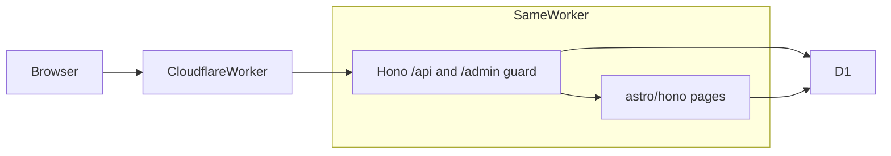

# Fuwari CMS

[English](./README.md) | **简体中文**

> **状态：一期功能可用 · 线上需自行部署**（阶段 0–4 完成；阶段 5 文档就绪，本仓库不代为执行远程命令）
> Fuwari 风前台 + Cloudflare D1 正文库 + 同站 `/admin` 写稿。

看起来像 [Fuwari](https://github.com/saicaca/fuwari)，但文章存在 D1、可后台编辑——跑在 **一个 Cloudflare Worker** 上，发文后刷新公开站即可见，不必把 Markdown 推进 Git 再构建。

进度与每阶段验收见 [PLAN.md](./PLAN.md)；重大变更见 [MONUMENTS.md](./MONUMENTS.md)；更早的取舍长文见 [docs/初版开发思路.md](./docs/初版开发思路.md)。英文说明见 [README.md](./README.md)（GitHub 仓库页默认展示）。

## 一句话

**同一 Worker：公开站长得像 Fuwari；管理员登录 `/admin` 用 Markdown 写文章；正文进 D1；发布后 SSR 直接读库。**

---

## 设计思路

| 想要 | 常见缺口 |
|------|----------|
| 好看（偏 Fuwari） | 不少 Cloudflare CMS 功能强，默认观感不对味 |
| 后台 + 真数据库 | Fuwari 本身是纯静态 Markdown，无 D1、无管理端 |
| 托管在 Cloudflare | 需要 Workers + D1（二期再可选 R2 / Workers AI） |

不是给别的 CMS 换皮，也不是继续用 Git 当数据库。

**策略：拷贝主题壳，替换内容源。** 从 Fuwari 固定提交 `6d39b0d` 带走 Layout / Navbar / 卡片 / Markdown 样式；去掉 Content Collections 与 `getCollection`。文章 Markdown 存在 D1 的 `body_md`，**写入时**在 Worker 里渲染成 `body_html`，前台只读缓存 HTML。草稿永远不进公开查询。

一期边界：封面/头像/banner 用 URL 字符串（外链或站点内路径），不上 R2；无评论、无 FTS 全文索引、无真 AI（`/api/admin/ai/*` 返回 501）。导航搜索走 `GET /api/search`（对已发布帖 `LIKE`，草稿不进结果）。`site_settings` 里空着的字段按字段 overlay [`src/config.ts`](./src/config.ts) 的当前前端默认值。

后台保持素：Markdown 文本框 + 预览弹窗。好看留给前台。

### 一期成功标准

对照 [docs/初版开发思路.md](./docs/初版开发思路.md) 第 12 节，**代码已满足**下列条目；线上是否通过取决于你是否按本文完成远端 D1、密钥与 `pnpm run deploy`。

- 管理员能登录后台，创建 / 编辑 / 发布 / 撤回草稿
- 公开站首页、文章页、标签 / 归档看起来就是 Fuwari 那路
- 刷新公开站能读到刚发布的 D1 内容，无需把文章文件 `git push`
- 草稿绝不会出现在公开列表
- 仓库有清晰归属：主题来自 Fuwari（MIT）

---

## 技术架构



| 层 | 选型 |
|----|------|
| 前台 | Astro 7 SSR + Tailwind 3（Fuwari `6d39b0d`，MIT） |
| 运行时 | Cloudflare Workers（`@astrojs/cloudflare` 14） |
| 入口 | [`src/fetch.ts`](./src/fetch.ts)：Hono `/api/*` → `/admin` session 守卫 → `astro/hono` 的 `actions()` / `middleware()` / `pages()` / `i18n()` |
| API | Hono（[`src/api/app.ts`](./src/api/app.ts)，可脱离 Astro 单测） |
| 数据库 | D1，binding 名 `DB`（不是环境变量） |
| 鉴权 | 单管理员；PBKDF2-SHA256；D1 `sessions` + HMAC 签名 Cookie `sid` |
| Markdown | [`src/lib/markdown.ts`](./src/lib/markdown.ts) 写入时渲染；围栏走 `rehype-expressive-code`（Shiki JavaScript 引擎） |
| 公开读 | [`src/lib/posts.ts`](./src/lib/posts.ts)，永远 `status = 'published'` |
| 后台写 | [`src/lib/admin-posts.ts`](./src/lib/admin-posts.ts)（含草稿） |

**密钥：** 必配且仅此一项——`SESSION_SECRET`。本地放 [`.dev.vars`](./.dev.vars.example)；生产用 `wrangler secret put`。**永远不要**写进 [`wrangler.jsonc`](./wrangler.jsonc) 或 Git。

**语言：** 访客 `locale` cookie 优先；没有 cookie 时用 D1 `site_settings.lang`，再空则 `src/config.ts` 的 `siteConfig.lang`。

Swup 忽略 `/admin`，后台自己切 tab。

---

## 数据库设计

Schema 以 [`migrations/`](./migrations/) 为准。读路径上，空字符串 / NULL 按字段回退 `src/config.ts`。

### `users`

| 列 | 说明 |
|----|------|
| `id` | INTEGER PK |
| `username` | UNIQUE；一期固定 `admin` |
| `password_hash` | PBKDF2 串，首次访问 `/admin/login` 写入 |
| `created_at` | 默认 `datetime('now')` |

### `sessions`

| 列 | 说明 |
|----|------|
| `id` | TEXT PK（32 字节 hex） |
| `user_id` | FK → `users`，ON DELETE CASCADE |
| `expires_at` | 登录时 `datetime('now', '+7 days')` |
| `created_at` | |

索引：`idx_sessions_expires_at`。

### `posts`

| 列 | 说明 |
|----|------|
| `id` | INTEGER PK |
| `slug` | UNIQUE，kebab-case |
| `title` / `description` | |
| `body_md` / `body_html` | 原文与写入时渲染结果 |
| `excerpt` / `headings_json` | 列表摘要与目录 |
| `cover_url` | 外链或站点路径 |
| `status` | `draft` \| `published` |
| `category` | 可空 |
| `lang` | 文章内容语言，默认 `en` |
| `published_at` | published 时非空（表级 CHECK） |
| `created_at` / `updated_at` | |
| `word_count` / `reading_minutes` | 写入时计算 |

索引：`idx_posts_status_published_at`（`status, published_at DESC`）。slug 靠 UNIQUE。

### `tags` / `post_tags`

多对多；侧栏标签与 `/archive/?tag=` 用这两张表。`post_tags` 主键 `(post_id, tag_id)`，删除文章级联。

### `site_settings`

单行，`id` 必须为 `1`。

| 列 | 来源 | 用途 |
|----|------|------|
| `avatar` / `name` / `bio` / `links_json` | 0002 | 侧栏资料与三链 |
| `banner_json` | 0002 | 首页 banner |
| `title` / `subtitle` / `footer` | 0003 | 导航品牌、副标题、页脚第二行 |
| `about_md` / `about_html` | 0003 | About 页 |
| `lang` | 0004 | 无 cookie 时的默认 UI 语言 |
| `updated_at` | | |

**禁止**把 [`scripts/seed.sql`](./scripts/seed.sql) 用 `--remote` 打进生产库（本地演示稿而已）。

---

## 本地开发

需要 Node ≥ 22.12；pnpm 由 Corepack 按 `package.json` 的 `packageManager` 提供（`corepack enable --install-directory <用户目录>` 后加入 PATH）。

```sh
pnpm install
cp .dev.vars.example .dev.vars   # 改 SESSION_SECRET；勿提交
pnpm db:migrate:local            # migrations/ → 本地 D1
pnpm db:seed:local               # 演示文章；不要 --remote
pnpm dev                         # http://localhost:4321
pnpm build                       # astro check + build → dist/
pnpm preview                     # wrangler 跑生产包
pnpm lint / pnpm format          # Biome
pnpm test                        # Vitest，跑在 workerd
```

`.dev.vars` 里的 `SESSION_SECRET` 换成足够长的随机串。首次打开 http://localhost:4321/admin/login 为用户名 `admin` 设密码（≥ 8，`users` 为空时）。登录后：

- `/admin` 文章（按发布时间轴，可搜，可按 Tag / 状态筛；**Re-render posts** 用当前渲染器刷新已有贴文 HTML，不改状态和时间）
- `/admin/profile` 头像、简介、三链、banner
- `/admin/site` 标题、页脚、默认语言
- `/admin/about` About Markdown

未写入 D1 的字段沿用 `src/config.ts`。若要重新设密：

```sh
pnpm exec wrangler d1 execute fuwari-cms --local --command "DELETE FROM sessions; DELETE FROM users;"
```

---

## 环境变量与绑定

一期 **只有一个密钥**，没有其它 `vars`。

| 名字 | 本地 | 生产 | 说明 |
|------|------|------|------|
| `SESSION_SECRET` | `.dev.vars` | `wrangler secret put SESSION_SECRET` | HMAC 签 `sid` Cookie；`wrangler.jsonc` 里 `secrets.required` 会在部署时校验它存在，但**不要把值写进 jsonc** |
| `DB` | wrangler 本地 SQLite | D1 绑定 | 在 [`wrangler.jsonc`](./wrangler.jsonc) 的 `d1_databases`，不是 env |

生成随机密钥示例：

```sh
# Unix
openssl rand -base64 32

# PowerShell
[Convert]::ToBase64String((1..32 | ForEach-Object { Get-Random -Maximum 256 }) -as [byte[]])
```

---

## 部署

本仓库**不代为执行**远端 `deploy` / `secret put` / `migrations apply --remote`。下面做完，才会出现 `*.workers.dev` 上的公开站和 `/admin`。

本地 `pnpm dev` 用的是 Wrangler 在 `.wrangler/` 里的 **本机 SQLite**，和 Cloudflare 上的 D1 **不是同一份库**：本机迁过表、写过文章、设过密码，线上都不会自动带过去。线上文章表一开始是空的（这是预期；空库不会自动灌示例稿，也不要跑 `pnpm db:seed:local`）。

两种方法共用下面 0–4；方法 A 在本机把 Worker 推上去，方法 B 用 GitHub Actions 做同一件事。

### 0. 本机与账号

1. Cloudflare 账号（免费计划即可；D1 + Workers 都在账号里）。
2. Node ≥ 22.12；pnpm 9 用 Corepack（见「本地开发」）。在仓库根目录 `pnpm install`。
3. 登录 Wrangler（浏览器 OAuth）。若提示 `Timed out waiting for authorization code`，重新执行一次，登录页要在超时前点允许：

```sh
pnpm exec wrangler login
```

方法 B 不依赖本机 OAuth，改用 API Token（见该方法）。`wrangler whoami` 可确认当前账号。

Worker 名来自 [`wrangler.jsonc`](./wrangler.jsonc) 的 `"name"`（默认 `fuwari-cms`）。部署成功后的地址形如 `https://fuwari-cms.<你的子域>.workers.dev`，以命令行打印的 URL 为准。若该名已被占用，改 `name` 再部署。

### 1. 创建远端 D1，并改配置

库名与 jsonc 里的 `database_name` 一致即可（默认 `fuwari-cms`）：

```sh
pnpm exec wrangler d1 create fuwari-cms
```

成功时会打印 `database_id`（一段 UUID）。**同一账号里这个名字只能建一次**；已经有了就不要再 create，改用：

```sh
pnpm exec wrangler d1 list
```

从列表抄 ID。

#### 不要让 CLI 再追加一条 binding

新版 Wrangler 成功后会问 *Would you like Wrangler to add it on your behalf?*

- 选 **no**，自己改 jsonc（推荐）。
- 若选了 **yes**：它会**再追加**一段，绑定名往往是 `fuwari_cms`，**不会**改你原来的 `DB`。代码和测试用的是 `env.DB`，多出来的那段没用，占位 ID 还在的话线上仍指错库。

无论选了什么，最后 [`wrangler.jsonc`](./wrangler.jsonc) 的 `d1_databases` **只能有一条**，并且必须是：

```jsonc
"d1_databases": [
  {
    "binding": "DB",
    "database_name": "fuwari-cms",
    "database_id": "把-create-或-list-打印的-UUID-贴这里",
    "migrations_dir": "migrations"
  }
]
```

要点：

- `binding` 必须是 **`DB`**，不要用 CLI 建议的 `fuwari_cms`。
- 用真实 UUID **替换**占位 `00000000-0000-0000-0000-000000000000`，不要并存两段。
- **留下** `"migrations_dir": "migrations"`，否则 `pnpm db:migrate:remote` 找不到 SQL。
- 若 CLI 还问本地是否连远端资源：选 **no**。`pnpm dev` 继续用本机 SQLite；远端库只给生产 Worker 用。
- `database_id` **可以提交到 Git**（它不是密钥，只是告诉 Wrangler 绑哪座库）。

### 2. 给生产 Worker 配 `SESSION_SECRET`

这一项只存在 Cloudflare 的 Worker secrets 里，**不要**写进 jsonc、不要写进 GitHub Actions 的 `env` / `vars`。本地 `.dev.vars` 只给 `pnpm dev` 用，**不会**随 `pnpm run deploy` 上传。

先生成一串随机值（见上一节「环境变量与绑定」），再执行：

```sh
pnpm exec wrangler secret put SESSION_SECRET
```

CLI 会停在 `Enter a secret value:`，输入被星号挡住，这是正常交互：把密钥**粘贴进去后回车**。成功后会提示已上传。没有这一步时，jsonc 里 `secrets.required` 会让部署直接失败。

生产密钥建议和本地 `.dev.vars` **不是同一串**。以后若要轮换，再 `secret put` 一次即可；旧的 `sid` Cookie 会立刻失效，需要重新登录。

### 3. 把表结构打到远端 D1

```sh
pnpm db:migrate:remote
```

等价于 `wrangler d1 migrations apply fuwari-cms --remote`，读取仓库 [`migrations/`](./migrations/)（`0001`–`0004`）。`pnpm db:migrate:local` **只改本机**，不会同步到线上。

**禁止**对远端执行 `pnpm db:seed:local` 或 `scripts/seed.sql`（那是本地演示稿）。线上贴文表为空是正常的，在 `/admin` 里自己写。

若报找不到 database / unauthorized：回头核对 `database_id`、`wrangler login` 的账号是否就是建库的那个。

### 4. 推送 Worker（方法 A，推荐）

```sh
pnpm run deploy
```

**必须带 `run`。** pnpm 9 把裸的 `pnpm deploy` 当成「从 workspace 拷包」，会报 `ERR_PNPM_CANNOT_DEPLOY`。`package.json` 里这个脚本是 `pnpm build`（`wrangler types` + `astro check` + `astro build`）再 `wrangler deploy`。

首次建议按 1 → 2 → 3 → 4 的顺序。之后：

| 你改了什么 | 做什么 |
|------------|--------|
| 页面 / API / 主题 | 再 `pnpm run deploy` |
| `migrations/` 新文件 | 先 `pnpm db:migrate:remote`，再按需 deploy |
| 只改 `SESSION_SECRET` | 再 `secret put`，不用重新 build |

部署结束时终端会给出 `*.workers.dev` URL。

### 5. 上线后第一次打开

1. 浏览器打开 `https://<上面打印的主机>/admin/login`。
2. `users` 为空时进入**设密**：用户名固定 `admin`，密码 ≥ 8。这是写进**远端** D1 的，和本机 `/admin/login` 那套密码无关。
3. 登录后：`/admin` 写文章，`/admin/profile` / `site` / `about` 改资料。空字段回退 [`src/config.ts`](./src/config.ts)。
4. 公开首页、归档、标签应能打开；草稿不会出现在未登录的公开列表。
5. 可选：Cloudflare Dashboard → Workers → 该 Worker → 自定义域（按 Dashboard 指引做 DNS）。自定义域同样走这个 Worker，后台路径仍是 `/admin/login`。

### 方法 B — GitHub Actions

适合每次 push 自动发版。本仓库**不附带** `.github/workflows` 文件（避免没配 Token 时 CI 变红）；需要时自己加。

1. Cloudflare Dashboard → **My Profile / API Tokens** → Create Token。权限至少：
   - Account · **Workers Scripts** · Edit
   - Account · **D1** · Edit
   Account ID 在 Dashboard 右侧或 Workers 概览页。
2. GitHub 仓库 **Settings → Secrets and variables → Actions** 增加：
   - `CLOUDFLARE_API_TOKEN`
   - `CLOUDFLARE_ACCOUNT_ID`
3. **`SESSION_SECRET` 仍然只通过方法 A 的 `wrangler secret put` 配在 Worker 上**（做一次即可，与 CI 无关）。不要把它放进 GitHub Secrets 再当构建 `vars` 注入——容易进日志，也会被误当成明文环境变量。`wrangler secret bulk` 同理，除非你清楚风险。
4. [`wrangler.jsonc`](./wrangler.jsonc) 的 `database_id` 必须已是真实 ID 并已提交；密钥不能提交。
5. 工作流建议：`pnpm install` → `pnpm build` → `pnpm db:migrate:remote` → `pnpm exec wrangler deploy`。首次用 `workflow_dispatch` 手动点一次，确认过再加 `push`。

示例（自行保存为 `.github/workflows/deploy.yml`）：

```yaml
name: Deploy
on:
  workflow_dispatch:
jobs:
  deploy:
    runs-on: ubuntu-latest
    timeout-minutes: 15
    steps:
      - uses: actions/checkout@v4
      - uses: pnpm/action-setup@v4
        with:
          version: 9
      - uses: actions/setup-node@v4
        with:
          node-version: 22
          cache: pnpm
      - run: pnpm install --frozen-lockfile
      - run: pnpm build
      - run: pnpm db:migrate:remote
        env:
          CLOUDFLARE_API_TOKEN: ${{ secrets.CLOUDFLARE_API_TOKEN }}
          CLOUDFLARE_ACCOUNT_ID: ${{ secrets.CLOUDFLARE_ACCOUNT_ID }}
      - run: pnpm exec wrangler deploy
        env:
          CLOUDFLARE_API_TOKEN: ${{ secrets.CLOUDFLARE_API_TOKEN }}
          CLOUDFLARE_ACCOUNT_ID: ${{ secrets.CLOUDFLARE_ACCOUNT_ID }}
```

CI 里不要写 `pnpm deploy`（同样会撞上 pnpm 内置命令）；也不要跑 `db:seed:local`。

### 常见问题

| 现象 | 原因 / 处理 |
|------|----------------|
| `ERR_PNPM_CANNOT_DEPLOY` | 写成了 `pnpm deploy`，改用 `pnpm run deploy`。 |
| `Enter a secret value:` 一直转圈 | `secret put` 在等粘贴密钥，粘贴后回车，不是卡死。 |
| jsonc 里出现两段 `d1_databases` | CLI 自动追加了 `fuwari_cms`。删掉那段，把 UUID 写进原来的 `DB`。 |
| 部署报缺 `SESSION_SECRET` | 还没 `secret put`，或 put 到了别的账号 / 别的 Worker 名。 |
| 线上没有文章 / 没有管理员 | 远端是空库。不要 seed；去 `/admin/login` 设密后自己发文。本机数据不会过去。 |
| 本机改了资料，线上还是默认 | `site_settings` 也分本地/远端。线上后台再保存一次，或接受 `config.ts` 默认值。 |
| `d1 create` 报名字已存在 | 用 `wrangler d1 list` 取已有 ID，不要再建一座同名库。 |

---

## 仓库结构

```
.
├── src/
│   ├── fetch.ts              # Worker 入口：Hono(/api) → /admin 守卫 → astro/hono
│   ├── api/app.ts            # Hono 路由（可脱离 Astro 单测）
│   ├── lib/posts.ts          # 公开文章（仅 published）
│   ├── lib/admin-posts.ts    # 后台文章（含草稿）
│   ├── lib/site-settings.ts  # 资料 / banner / 站点身份 / about
│   ├── lib/markdown.ts       # 写入时 Markdown → body_html（含代码高亮）
│   ├── lib/auth/             # PBKDF2 + D1 session + 首次设密
│   ├── plugins/              # 改编自 Fuwari 的 remark 插件
│   ├── types/post.ts         # PostEntry：预渲染 bodyHtml + 摘要/字数/目录
│   ├── pages/ components/ layouts/ styles/ i18n/ utils/ constants/ assets/ config.ts
│   │                         # Fuwari 主题（见 third_party/fuwari/README.md）
├── tests/                    # Vitest（workerd）
├── migrations/               # D1 迁移 SQL
├── scripts/seed.sql          # 本地演示文章（不要 --remote）
├── astro.config.mjs  wrangler.jsonc  vitest.config.ts  biome.json  tsconfig.json
├── README.md                 # 英文（GitHub 默认）
├── README.zh-CN.md           # 简体中文
├── PLAN.md  MONUMENTS.md  AGENTS.md
├── docs/初版开发思路.md
├── LICENSE  NOTICE
└── third_party/fuwari/       # 上游 MIT 原文 + 拷贝清单
```

---

## 分期

**一期（MVP，已实现）**
登录、文章 CRUD、资料/站点/About、中英 UI、公开列表/详情/标签/归档对齐 Fuwari、草稿不公开、导航搜索（`/api/search`）、围栏代码高亮（后台可批量重渲染已有贴文）。

**二期**
R2 上传、Workers AI（标题/摘要等）、D1 FTS5。

**三期**
更舒服的编辑器、统计与其它扩展（按需）。

---

## 许可与归属

本项目自有内容采用 **[MIT License](./LICENSE)**
Copyright (c) 2026 Angelen Atano

前台主题基于 **[Fuwari](https://github.com/saicaca/fuwari)**（MIT © 2024 saicaca）提交 `6d39b0d`。上游许可原文见 [`third_party/fuwari/LICENSE`](./third_party/fuwari/LICENSE)，拷贝与改编清单见 [`third_party/fuwari/README.md`](./third_party/fuwari/README.md)；完整第三方说明见 [`NOTICE`](./NOTICE)。

选用 MIT 的原因：与 Fuwari 及 Astro / Hono 等依赖许可兼容，便于复用主题并保持后续自有代码同样宽松可分发；本仓库**不**基于 GPL 等强 copyleft 成品派生。

---

## 欢迎

如果你也想要「好看的个人博客 + Cloudflare 真 CMS」，欢迎 Watch / Star，或开 Issue 聊需求与取舍。
实现进度会直接推到本仓库。
